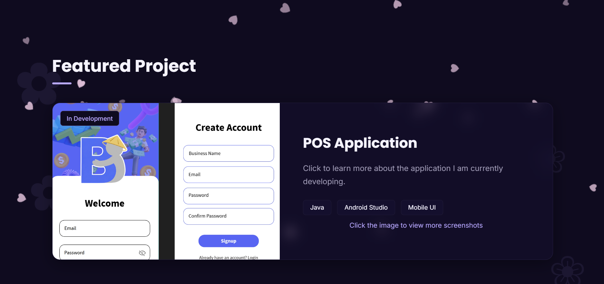
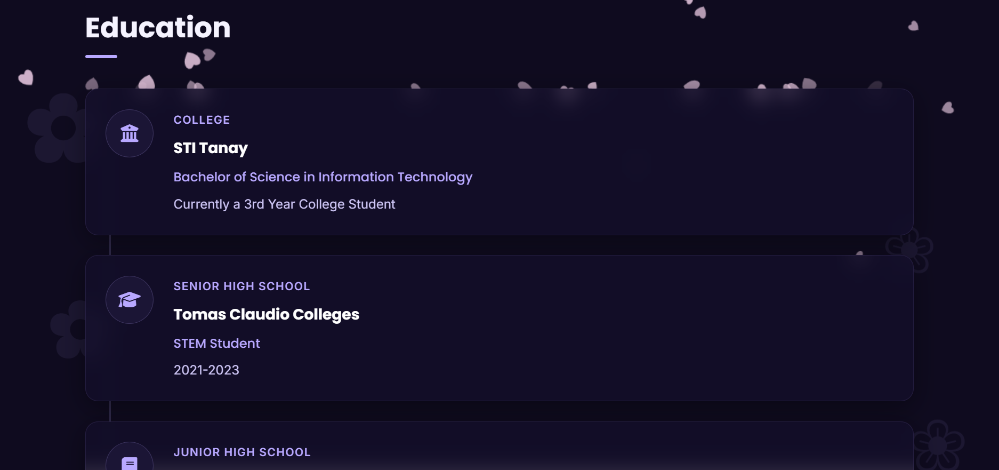

# Seila Mañas Portfolio

## Description

This is my personal portfolio website developed as part of my Bachelor of Science in Information Technology studies. The website showcases my educational background, projects, and the technologies I am currently learning. It also highlights my featured project, BentaBuddy, a Point of Sale (POS) application currently under development.

## Technologies Used

* HTML5
* CSS3
* JavaScript

## Screenshots

### Home Page

### Featured Project

### Education Section

## Live Website

https://xela-1605.github.io/seila-portfolio/

## Author

Seila Mañas

BS Information Technology Student
STI Tanay
